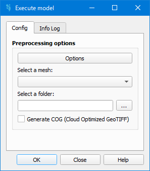

.. _dialog-execute-model:

====================
Dialog Execute model
====================

.. only:: html

    .. contents::
       :local:

    Execute model.

Window to execute the model. From the *Options* menu, you can access the *Go2Iber-options* panel, where you can configure any remaining simulation settings. **You must select the computational mesh** to be used in the simulation process, as well as **the directory where the model files will be saved**.