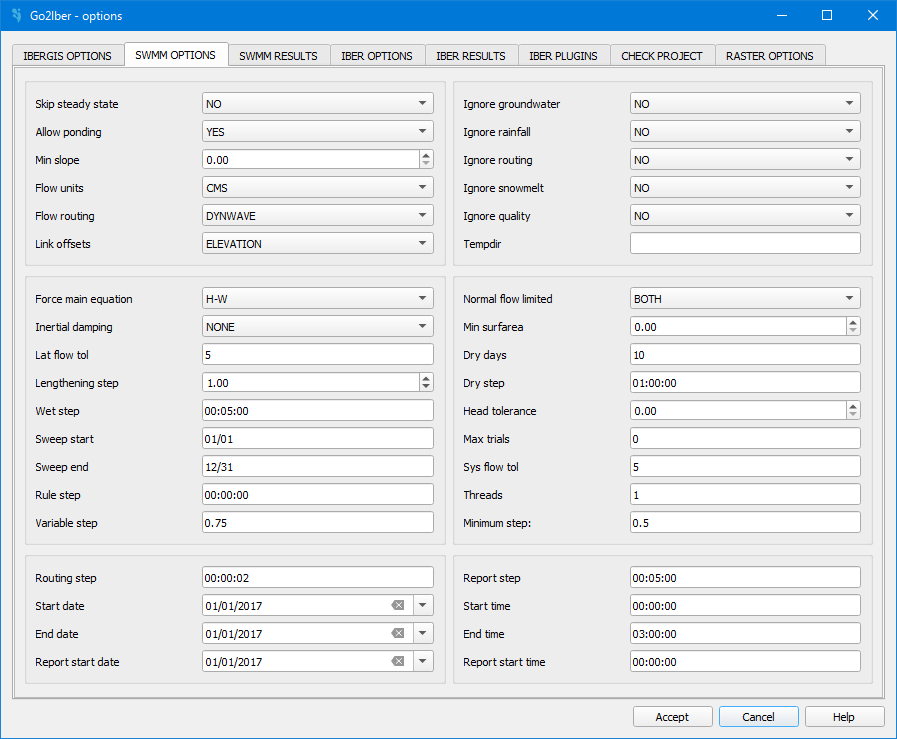
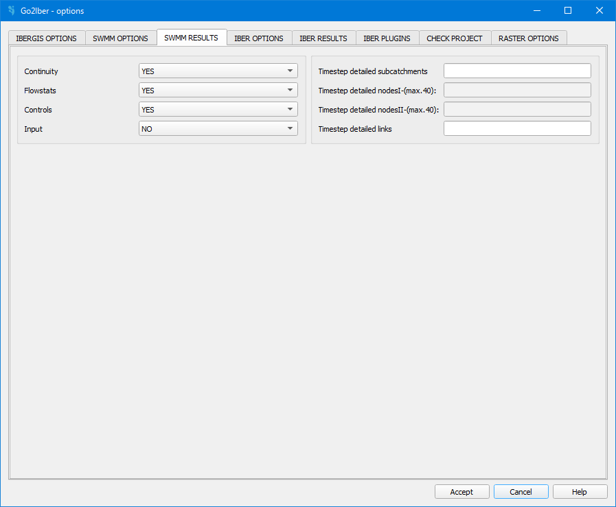
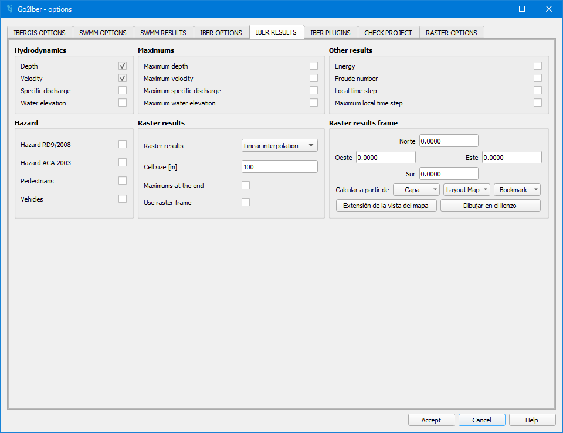
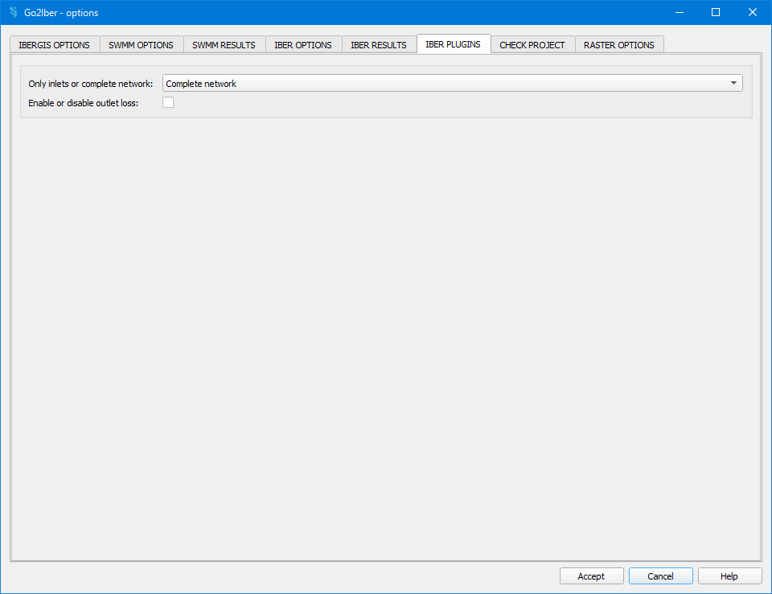

.. _dialog-go2iber-options:

======================
Dialog Go2Iber options
======================

.. only:: html

    .. contents::
       :local:

Tool to manage all the options involved in the simulation. We can manage the SWMM and Iber options.

Tab SWMM OPTIONS
================

    SWMM options.

The following options are available:

- Skip steady state: it allows to omit the steady phase at the beginning of the hydraulic simulation. The default is NO.
- Allow ponding: determines whether excess water is allowed to collect atop nodes and be re-introduced into the system as conditions permit.
  The default is YES. In order form ponding to actually occur at a particular node, **a non-zero value for its ponded area attribute must be used** (field *apond* on Junction layer).
- Min slope: minimum value allowed for a conduit's slope (%). If zero (the default) then no minimum is imposed (although SWMM uses a lower limit on elevation drop of 0.00035 m when computing a conduit slope).
- Flow units: allow choice the flow units. The default is CMS.
- Flow routing: allow choice which method is used to route flows through the drainage system. The default is DYNWAVE.
- Link offsets: determines the convention used to specify the position of a link offset above the invert of its connecting node.
  DEPTH indicates that offsets are expressed as the distance between the node invert and the link, while ELEVATION indicates that the absolute elevation of the offset is used. The default is ELEVATION.
- Ignore groundwater: allow choice if groundwater calculations should be ignored when a project file contains aquifer objects. The default is NO.
- Ignore rainfall: allow choice if all rainfall data and runoff calculations should be ignored. If is set to YES, SWMM only performs flow and pollutant routing based on user-supplied direct and dry weather inflows.
  The default is NO.
- Ignore routing: allow choice if only runoff should be computed even if the project contains drainage system links and nodes. The default is NO.
- Ignore snowmelt:allow choice if snowmelt calculations should be ignored when a project file contains snow pack objects. The default is NO.
- Ignore quality: allos choice if pollutant washoff, routing and treatment should be ignored in a project that has pollutants defined. The default is NO.
- Tempdir:
- Force main equation: establishes wheter the Hazen-Williams (H-W) or the Darcy-Wesbach (D-W) equation will be used to compute friction losses for pressurized flow in conduits that have been assigned
  a circular force main cross-section shape. The default is H-W.
- Inertial damping: indicates how the inertial terms in the Saint Venant momentum equation will be handled under dynamic wave flow routing.
  Choosing NONE (the default) maintains these terms at their full value under all conditions. Selecting PARTIAL will reduce the terms as flow comes closer to being critical (and ignores them when flow is supercritical).
  Choosing FULL will drop the terms altogether.
- Lat flow tol: maximum percent difference between the current and previous lateral inflow at all nodes in the conveyance system in order for the *Skip steady state* option to take effect. The default is 5 percent.
- Lengthening step: time step, in seconds, used to lengthen conduits under dynamic wave routing, so that they meet the Courant stability criterion under full-flow conditions
  (i.e., the travel time of a wave will not be smaller than the specified conduit lengthening time step). As this value is decreased, fewer conduits will require lengthening.
  A value of 0 means that no conduits will be lengthened. The default is 1.
- Wet step: time step length used to compute runoff from subcatchments during periods of rainfall or when ponded water still remains on the surface. The default is 00:05:00.
- Sweep start: day of the year (month/day) when street sweeping operations begin. The default is 01/01.
- Sweep end: day of the year (month/day) when street sweeping operations end. The default is 12/31.
- Rule step:
- Variable step: safety factor applied to a variable time step computed for each time period under dynamic wave flow routing. The variable time step is computed so as to satisfy the Courant
  stability criterion for each conduit and yet not exceed the *Routing step* value. If the safety factor is 0, then no variable time step is used. The default is 0.75.
- Normal flow limited: specifies which condition is checked to determine if flow in a conduit is supercritical and should thus be limited to the normal flow.
  Use SLOPE to check if the water surface slope is greater than the conduit slope, FROUDE to check if the Froude number is greater than 1 or BOTH to check both conditions. The default is BOTH.
- Min surfarea: minimum surface area used at nodes when computing changes in water depth under dynamic wave routing. If 0 is entered, then the default value of 1.167 m² is used (i.e., the area of a 1,2192 m diameter manhole).
- Dry days: number of days with no rainfall prior to the start of the simulation. The default is 10.
- Dry step: time step length used for runoff computations (consisting essentially of pollutant buildup) during periods when there is no rainfall and no ponded water. The default is 1:00:00.
- Head tolerance: difference in computed head at each node between successive trials below which the flow solution for the current time step is assumed to have converged. The default tolerance is 0.
- Max trials: maximum number of trials allowed during a time step to reach convergence when updating hydraulic heads at the conveyance system's nodes. The default value is 0.
- Sys flow tol: maximum percet difference between total system inflow and total system outflow which can occur in order for the *Skip steady state* option to take effect. The default is 5 percent.
- Threads: number of parallel computing threads to use for dynamic wave flow routing on machines equipped with multi-core processors. The default is 1.
- Minimun step: the smallest time step allowed when variable time steps are used for dynamic wave flow routing. The default is 0.5.
- Routing step: time step length in seconds used for routing flows and water quality constituents through the conveyance system. This can be increased if dynamic wave routing is not used.
  The default is 00:00:02.
- Start date: the date when the simulation begins. If not supplied, a date of 01/01/2017 is used.
- Report start date: the date when reporting of results is to begin. The default is the simulations start date.
- End date: the date when the simulation is to end. The default is the start date.
- Report step: time interval for reporting of computed results. The default is 00:05:00.
- Start time: time of day on the starting date when the simulation begins. The default is 00:00:00.
- End time: time of day on the ending date when the simulation will end. The default is 03:00:00.
- Report start time: time of day on the report starting date when reporting is to begin. The default is the simulation start time of day.

Tab SWMM RESULTS
================

   SWMM results.

The following options are available:

- Continuity: specifies if continuity checks should be reported or not. The default is YES.
- Flowstats: specifies whether summary flow statistics should be reported or not. The default is YES.
- Controls: specifies whether all control actions taken during a simulation should be listed or not. The default is YES.
- Input: specifies whether or not a summary of the input data should be provided in the output report. The default is NO.
- Timestep detailed subcatchments: list of subcatchments whose results are to be reported. The default is blank.
- Timestep detailed nodes I and II: list of nodes whose results are to be reported. The default is blank. A maximum of 40 nodes can be written in each of them.
- Timestep detailed links: list of links whose results are to be reported. The default is blank.

Tab IBER OPTIONS
================

   Iber options.

The following options are available:

Project details
---------------

- Project name: name of the project.
- Description: a short description of the project.
- User: name of the user.
- Creation date: creation date of the project.
- Version: Drain version.

Numerical scheme
----------------

- Numerical scheme: you can choose between various numerical schemes. 1st Order is recommended for hydraulic calculations, while DHD is recommended for hidrological rain-surface flow transfromations.
- CFL: Courant–Friedrichs–Lewy condition. The user must set the value. If a very high value is set, the computation time will be reduced, but convergence issues may arise in the solution of the equations. A value of 0.45 can be considered appropriate as a starting point, and it can be lowered to 0.3 if convergence problems are observed.
- Max time increment: Sets the maximum value of the time step used by the program to integrate the flow equations. This is a maximum value. In practice, the time step used during the simulation will be the minimum between this value and the one computed based on the CFL condition.
- Wet-dry limit: this is the depth threshold above which an element is considered wet. Below this value, the element is considered dry, 
and therefore no computations are performed on it, unless it becomes wet. While in river engineering, a threshold of 0.01 m is generally reasonable, in some cases this value could be reduced to as little as 0.001 m.
- Viscosity coefficient:
  
  ..important:: DHD and DHD Basin schemes must not be used for hydraulic simulations

Time & Simulation control
-------------------------

- Initial time: instant in which the calculation begins. It is just an "offset" and does not affect the results. 
- Max simulation time: instant in which the calculation ends. The time difference between the "initial time" and the "max simulation time" indicates the total simulation time.
- Results 2D time interval: indicates the time interval length in which results are calculated
- Timeseries time interval: selection of the time interval length in which results are written
- Simulation details are written:
- New simulation or current simulation:
- Enable or disable simulation plan:
- Plan ID:

Hydrological processes
----------------------

- Start time infiltration:
- Precipitation:
- Set rainfall for all hyetografs:
- Set rainfall raster:
- Losses model: here you can select the infiltration model to apply. You can choose between *SCS* (Soil Conservation Service) infiltration model or *no losses* model 
- CN multiplier: multiplier of the CN parameter of the SCS model. 
- Ia: Initial abstraction. Refers to the portion of rainfall that is retained or lost before producing surface runoff. When no specific information about the catchment is available, a typical value of 0.2 is often used.  

Tab IBER RESULTS
================

  
  Iber results.

The following options are available:

- Depth: refers to the vertical distance from the bed to the free surface of the water, expressed in meters (m). 
- Velocity: refers to the depth-averaged flow velocity, expressed in meters per second (m/s)
- Specific discharge: refers to the flow rate per unit width, expressed in square meters per second (m²/s)
- Water elevation: refers to the height of the water surface, commonly expressed in meters above the sea level (m).
- Maximum depth: the maximum water depth reached at each specific element during the simulation (m).
- Maximum velocity: the maximum velocity reached at each specific element during the simulation (m/s).
- Maximum specific discharge: the maximum specific discharge reached at each specific element during the simulation (m2/s).
- Maximum water elevation: the maximum water elevation reached at each specific element during the simulation (m)
- Energy: refers to the total hydraulic energy per unit weight of water, typically resulting from the sum of elevation head, pressure head, and velocity head, expressed in meters (m)
- Froude number: a dimensionless number that represents the ratio between inertial and gravitational forces. A value equal to 1 indicates critical flow; values less than 1 indicate subcritical flow, while values greater than 1 indicate supercritical flow.
- Local time step:
- Maximum local time step:
- Hazard RD9/2008: calculated hazard according to RD9/2008 regulation (Spain). 
- Hazard ACA 2003: flood hazard calculated following the criteria by the ACA (*Agencia Catalana del Agua*).
- Raster results: if selected, raster results will be writen. The interpolation mode must be selected (linear interpolation or nearest interpolation. The interpolation
is calculated using the results obtained through the simulation, being located at the central node of each element).
- Cell size: defines the size of each cell for the raster results (m). 
- Maximum critical diameter: the maximum critical diameter reached trought the simulation, meaning that sediments with higher diameters would not be carried by the flow. 
- Manning coefficient: roughness parameter that represents the resistance of the ground surface to runoff movement (s/m^(1/3). 
- Depth vector:
- Critical diameter: diameter of the paricle that sets the threshold between motion and no motion under specific flow conditions. Particles with smaller diameters would be transported by the flow, while bigger particles would remain settled.
- Bed shear stress: it is the force exerted by the flow on the bed surface beneath it, resulting from friction and roughness effects (N/m2). 
- Maximum bed shear stress: the maximum bed shear stress reached at each specific element during the simulation (N/m2).
- Streamlines: lines that represent the instant flow direction at a given moment. 

Tab IBER PLUGINS
================

    Iber plugins.

The following options are available:

- Only gullies or complete network:
- Enable or disable outlet loss: