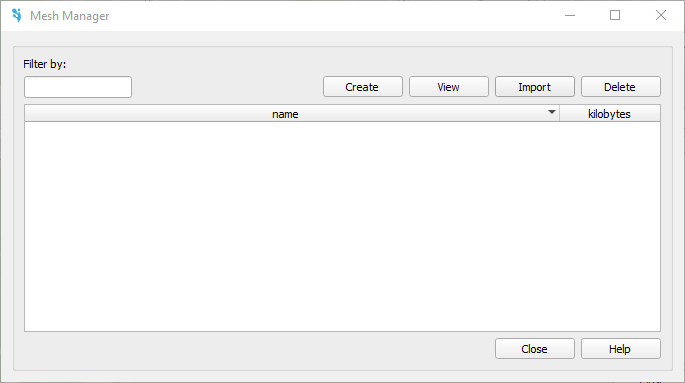
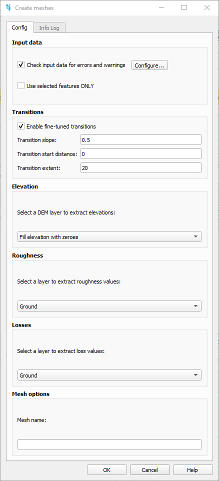
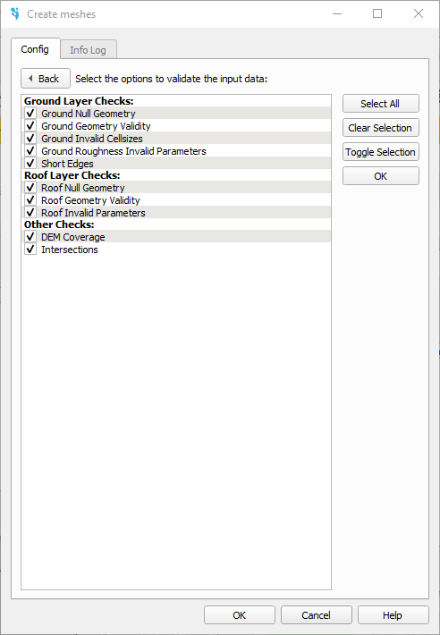

.. _dialog-mesh-manager:

===================
Dialog Mesh manager
===================

.. only:: html

    .. contents::
       :local:
       
Tool for incorporating the mesh into the model. Having a mesh is not only essential for the calculations to be done, since it defines the calculation elements; but is also the one getting the values of the distributed parameters of the model trough its net, such as land uses or curve number for the infiltration model. The mesh can be created or directly imported. The different scenarios created for diverse boundary conditions must be also saved to a existing mesh. 

  
  Mesh manager.

To create the mess the *create* button must be pressed. When done it, a new window will emerge: 

  
  Create meshes.

Input data
============
- Check input data for errors and warnings: here it is possible to check if the input data have any error. To configure the errors to be checkeded the button *Configure...* must be pressed, and the following options will be available, allowing the user to select all the checks, or specific ones:

  
  Input data check.

- Use selected features ONLY: completar

Transitions
============
This section allows the user to configure the mesh transition settings, which control how smoothly the mesh resolution decreases from the breaklines toward the interior of the domain.
To this aim, the *Enable fine-tuned transitions* must be active. In this case, the user can define the value of the transition slope, the distance in which the transition begins, and the transition extent. 
To do so, the Enable fine-tuned transitions option must be activated. Once enabled, you can define the following parameters:
 - Transition slope: controls how quickly the mesh size increases from the high-resolution zone.
 - Transition start distance: sets how far from the breakline the transition begins.
 - Transition extent: determines the total distance over which the transition is applied.
 These settings help control the smoothness and spread of mesh refinement across the domain.

Elevation
==========
Here you must select the layer that contains the elevation data for the study area.

Roughness
=========
Here you must select the layer that contains the land use or surface roughness data for the study area. This layer will be used to assign Manning's roughness coefficients.

Losses
=======
Here you must select the layer that contains the infiltration information, such as the distributed Curve Number parameter.

Mesh options
=============
This field allows you to save the mesh with a specific name. This name will later help you identify the mesh you want to work with when assigning the boundary conditions scenario.