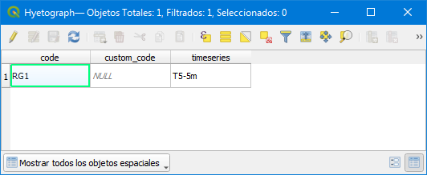
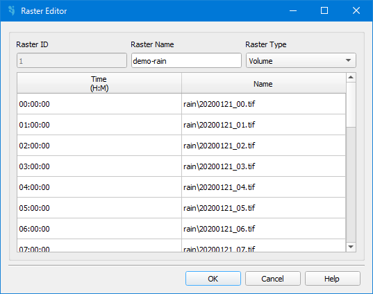

.. _dialog-non-visual-obj:

=========================
Dialog Non visual objects
=========================

.. only:: html

    .. contents::
       :local:

Tool to manage the non visual objects of the project.

.. figure:: img/non-visual-obj-curves.png

  Window to manage the non visual objects.

We can manage curves, patterns, timeseries, controls and rasters.
In all cases, the following buttons are available:

- Duplicate: it allows to duplicate a selected object.
- Create: it allows to create a new object.
- Delete: it allows to delete a selected.

This window is used to create and configure non-visual objects. These elements are stored in the model and can be selectively activated depending on the requirements of each simulation.

Curves
=======
Here you can enter several types of curves, namely: *Control*, *Diversion*, *Pump 1*, *Pump 2*, *Pump 3*, *Pump 4*, *Rating*, *Shape*, *Storage* and *Tidal*. They must be defined by the user. 
 - Control:
 - Diversion:
 - Pump 1:
 - Pump 2: 
 - Pump 3:
 - Pump 4:
 - Rating:
 - Shape: 
 - Storage:
 - Tidal: 

Patterns
=========

Timeseries
===========

Several time series can be defined, such as *BC ELEVATION*, *INFLOW HYDROGRAPH*,  *EVAPORATION*, *ORIFICE*, *RAINFALL*, and *TEMPERATURE*.
 - BC elevation: Boundary condition to set  a specific water surface elevation.
 - Inflow hydrograph: Boundary condition used to define a specific inflow over time using a hydrograph (discharge vs time). This allows modeling variable flow entering the domain.
 - Evaporation: A time series of evaporation rates can be loaded to account for water loss due to this factor during long hydrological simulations.
 - Orifice:
 - Rainfall: Allows the user to define a hyetograph to be used in the model. Each hyetograpgh is associated with specific spatial coordinates and ist location can be manually adjusted using the vertex editor, by toggling the editing mode in QGIS and dragging the point to the desired location.
    - If only one hyetograph is provided, the entire domain will receive homogeneous rainfall based on that hyetograph.
    - If multiple hyetographs are loaded, rainfall distribution across the domain will be interpolated using Thiessen polygons.
 - Temperature: a time series of temperatue can be loaded. 

Except for the *BC ELEVATION* option, in all other cases the data can be defined either manually (using relative or absolute times) or by importing it from an external file.

.. figure:: img/non-visual-obj-timeseries.png

  Time Series Editor.

  
To assign any of the previously defined time series to the model, you must specify the location or geometry where the series will be applied. This can be done through the attribute table by toggling the editing mode and selecting the relevant geometry. The attribute table displays one row for each geometry or location in the domain. To assign the appropriate time series to each location, activate the editing mode and use the drop-down menu in the "timeseries" column to choose from the predefined time series.

  The spatial assignment of time series must be performed through the attribute table. Each row represents a specific geometry in the model, and a corresponding time series must be defined for it. By toggling the editing mode to *active* and clicking on the *timeseries* cell, a drop-down menu will appear, allowing the user to select the appropriate predefined time series.

Controls
=========

Rasters
========
A distributed rainfall can also be defined using a sequence of raster files. These rasters may represent either rainfall volume (mm) or rainfall intensity (mm/h). The user must specify the type of data contained in the rasters, as well as the corresponding timestamp for each file to ensure correct temporal assignment during the simulation.

  Curve Editor. 

.. important:: The non-visual objects must be assigned to their corresponding locations (geometries) in the model via their respective attribute tables.
  
